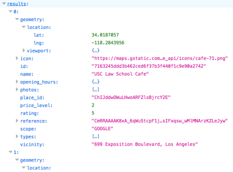

# PHP version of place search web app

This is practice to create a webpage on PHP that allows to search for places information using the Google Place API, and the results will be displayed in a tabular format. The page will also provide reviews and photos for the selected place.

## Description

* Fetch the user's geolocation using the [ip-api.com](http://ip-api.com/) HTTP API
* Use HTML5 placeholder to show the default value hint.
* Search place detail using [Google Place API](https://developers.google.com/places/)

### Google Place API

This uses google Map APIs. Especially, it uses "Neary by Search", "Place Details", and "Place Photos".

#### [Nearyby Search](https://developers.google.com/places/web-service/search)

The Google places API Nearby Search service expects the following parameters:
* Key: Your application's API key.This key identifies your application for purposes of quota management.
* Location: The geo-location around which to retrieve place information. The geo-location is specified by latitude and longitude values.
* Radius: Defines the distance (in meters) within which to return place results. The maximum allowed radius is 50,000 meters. Note that you need to translate miles to meters for a correct value.
* Type: Filtering the results to places matching the specified type. Only one type may be specified (if more than one type is provided, all types following the first entry are ignored).
* Keyword: A term to be matched against all content that Google has indexed for this place, including but not limited to name, type, and address, as well as customer reviews and other third-party content.

An examples of an HTTP requests to the Google Places API Nearby Search that searches for the neary cafes near the University of Southern California within a 10 miles radius is shown below:

Result of Nearby Search Query

An Example of a Valid Search result

#### Place Detail

HTML and CSS (Hypertext MarkUp Language and Cascading Style Sheets),
HTTP (HyperText Transfer Protocol),
Web servers, their configuration and performance properties,
Client-side Programming Using JavaScript,
Ajax (Asynchronous JavaScript & XML) and JSON (JavaScript Object Notation),
Server-side Programming Using PHP and JavaScript

In addition the course  also covered the following subsidiary topics:

Web Services (REST),
Web Security,
Web Technologies for Mobile Phones (Android and iOS),
Responsive Website Design,
Cloud Computing (Amazon Web Services and Google Cloud Platform),
AngularJS and Nodes.js,
Serverless Applications,
AWS Lambda and Google Functions

CSCI571-Course Website: http://cs-server.usc.edu:45678/
Professor Marco Papa: http://intersectworld.net/papa/

## Homework - 3
This homework required us to reproduce the provided page as closely as possible. We were not allowed to use any frameworks and required us to do it with **HTML, CSS** (and like the professor said, code as if you are in 1995).

## Homework - 4
This homework consisted of writing a **HTML/Javascript** program that takes a JSON URL as input which contains Airline Information, the program then parses the **JSON** file and extracts the list of Airlines, and displays them in a formatted table. All of the parsing and formatting is done with the help of Javascript that is embedded in HTML. It can be executed in any browser. It also handles the various error cases that can be present in a JSON.

## Homework - 6
This homework required us to use **PHP and Javascript** and create a webpage that allows us to search for stock information using the Stock quote API, and the results will be displayed in both tabular format and charts format using **HighCharts**.The page also provides News clips for the selected stock.  

## Homework - 8
This homework required the use of **Node.js, Angular 4.0, Amazon Web Services, FB API (Feed), Bootstrap, JQuery, JSON, HTML5**  to build a webpage that displays stock information, chart data, historical charts and news for a selected stock. It involved the usage of MarkitOnDemand API for Autocompletion, AlphaVantage API for getting stock, indicator for a stock data in JSON format. Highcharts to generate charts for indicators and historical data. Also, the highcharts export API was used to generate image urls, which can then be used to share the images to the Facebook Feed of the user. The Seeking Alpha news API was used for news section of the app.We also made use of the HTML5 local storage to store stock favourites, implement auto refresh and forced refresh functions for these saved stocks. 
This homework required us to make a Responsive Web Site (Using Bootstrap) that would automatically scale with the devices (Desktop, Mobile, Tablet).

## Homework - 9
This homework required us to use **Android** to replicate the functionality of Homework - 8 in a mobile app. We were given the choice of an Android or an iOS app. I replicated the functionality in an Android app. 

