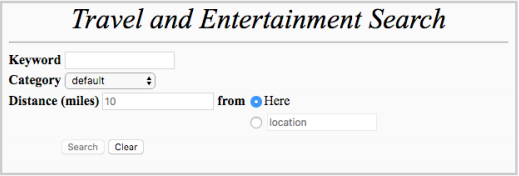
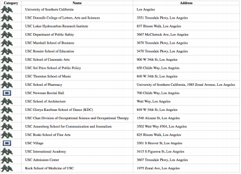
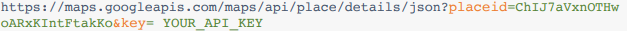
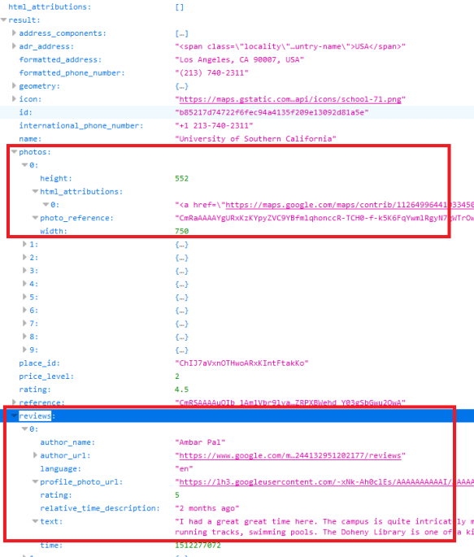
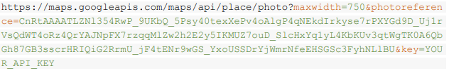
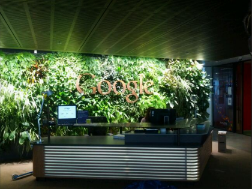
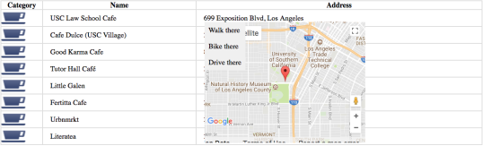
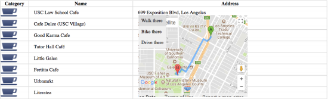

# PHP version of place search web app

This is practice to create a webpage on PHP that allows to search for places information using the Google Place API, and the results will be displayed in a tabular format. The page will also provide reviews and photos for the selected place.

## Description

* Fetch the user's geolocation using the [ip-api.com](http://ip-api.com/) HTTP API
* Use HTML5 placeholder to show the default value hint.
* Search place detail using [Google Place API](https://developers.google.com/places/)

### Google Place API

This uses google Map APIs. Especially, it uses "Neary by Search", "Place Details", and "Place Photos".

#### [Nearyby Search](https://developers.google.com/places/web-service/search)

The Google places API Nearby Search service expects the following parameters:

* Key: Your application's API key.This key identifies your application for purposes of quota management.
* Location: The geo-location around which to retrieve place information. The geo-location is specified by latitude and longitude values.
* Radius: Defines the distance (in meters) within which to return place results. The maximum allowed radius is 50,000 meters. Note that you need to translate miles to meters for a correct value.
* Type: Filtering the results to places matching the specified type. Only one type may be specified (if more than one type is provided, all types following the first entry are ignored).
* Keyword: A term to be matched against all content that Google has indexed for this place, including but not limited to name, type, and address, as well as customer reviews and other third-party content.

An examples of an HTTP requests to the Google Places API Nearby Search that searches for the neary cafes near the University of Southern California within a 10 miles radius is shown below:

Result of Nearby Search Query

An Example of a Valid Search result

A Valid Search Result rendering

#### [Place Detail](https://developers.google.com/places/web-service/details)

The Google Places API Details service expects the following parameters:

* place_id: An id returned as result of Google Places API nearby search service
* Key: Your application's API key.This key identifies your application for purposes of quota management.

An example of an HTTP request to the Google Places API Place Details is shown below:

An Example of a Valid Search result

#### [Place Photos](https://developers.google.com/places/web-service/photos)

The Google Places API Photos service expects the following parameters:

* Photo_reference: A string identifier that uniquely identifies a photo. Photo references are returned from either a Place Search or Place Details request.
* Key: Your application's API key.This key identifies your application for purposes of quota management.
* maxheight or maxwidth: Spedifies the maximum desired height or width, in pixels, of the image returned by the Place Photos services.

An example of an HTTP request to the Google Places API Place Photos is shown below:

An Example of a Valid result

#### [Google Map](https://developers.google.com/maps/documentation/javascript/adding-a-google-map)

A sample of Google Map with "699 Exposition Blvd, Los Angeles"

#### [Directions](https://developers.google.com/maps/documentation/javascript/adding-a-google-map)

A sample of Google Map Direction

### Building Environment
* Apach 2
* NGINX 1
* PHP5

### Status

This is a assignment of CSCI-571 Webtechnologies, 2018 spring

Version 1.0
