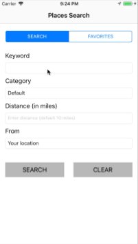
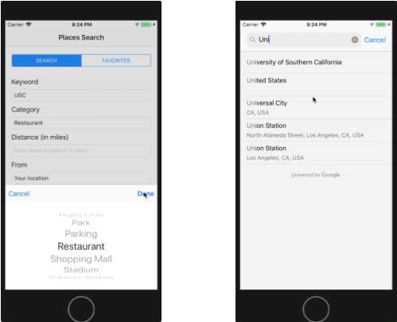
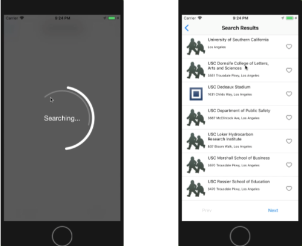
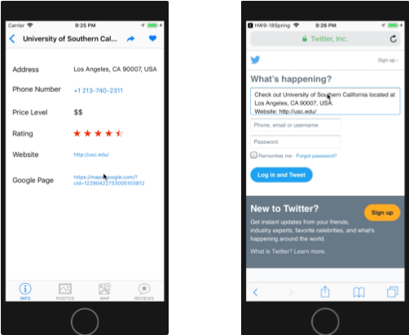
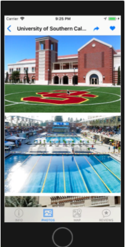
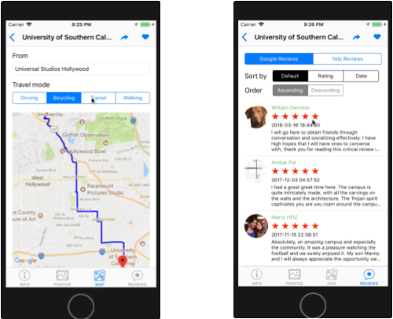

# PHP version of place search web app

This is practice to create a IOS app on Swift. This app uses a server of "02_PlaceSearch_Nodejs" that allows to search for places information using the Google Place API, and the results will be displayed in a tabular format. The page will also provide reviews and photos for the selected place.

## Description

* [CocoaPods](https://cocoapods.org/) - A dependency manager for Swift and Objective-C Cocoa project.
* Search place detail using [Google Place API](https://developers.google.com/places/)
* Reviews of the place using [Yelp API](https://www.yelp.com/developers/v3/manage_app)

## Building Environment
* Xcode 10.1
* Alamofire 4.7.1
* AlamofireSwiftyJSON 1.0.1
* Cosmos 15.0.0
* EasyToast 2.0.2
* GoogleMaps 2.6.0
* GooglePlacePicker 2.6.0
* GooglePlaces 2.6.0
* McPicker 1.0.0
* SwiftSpinner 1.5.0
* SwiftyJSON 4.0.0

## Status

This is a assignment of CSCI-571 Webtechnologies, 2018 spring

Version 1.0
